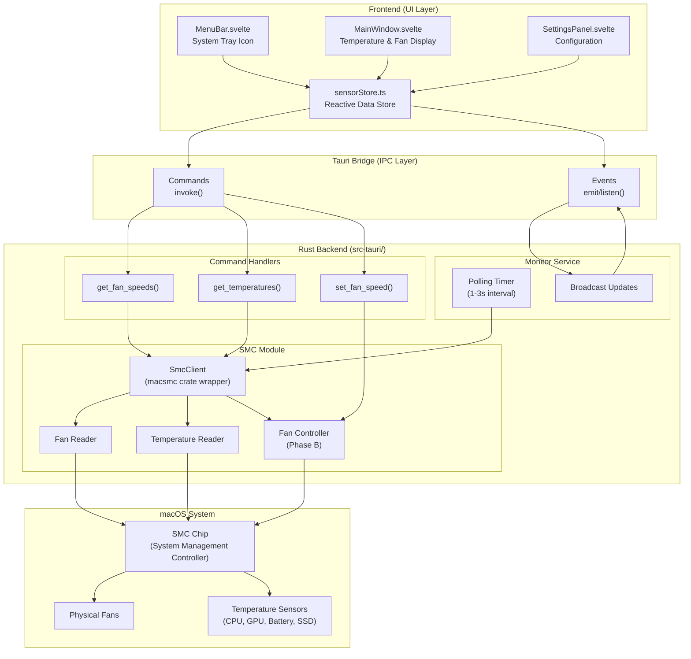
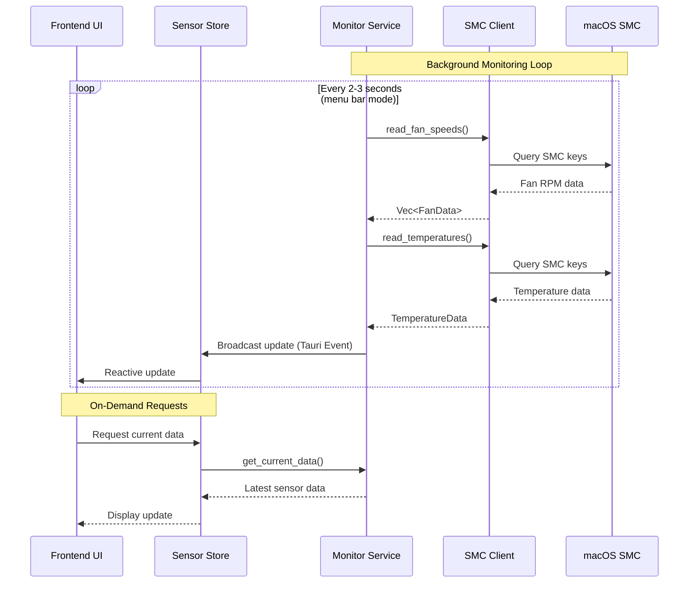
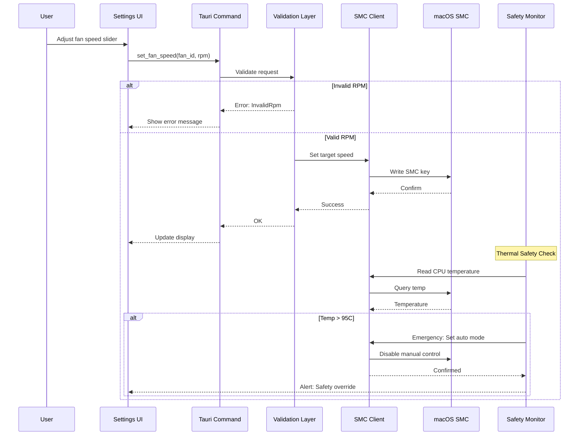
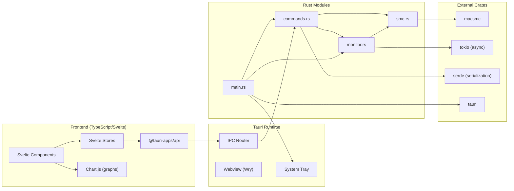
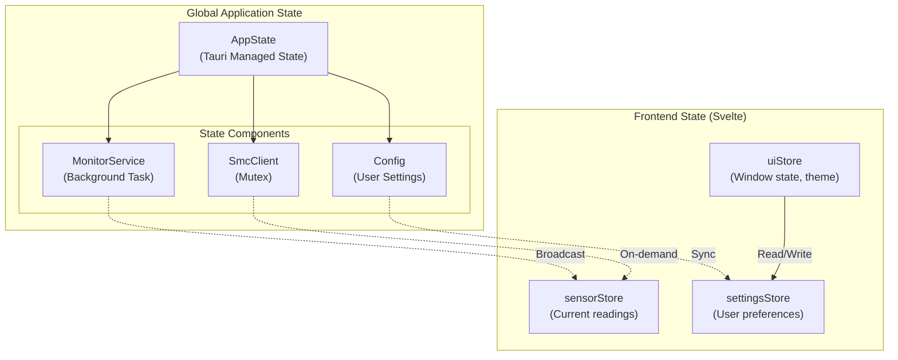
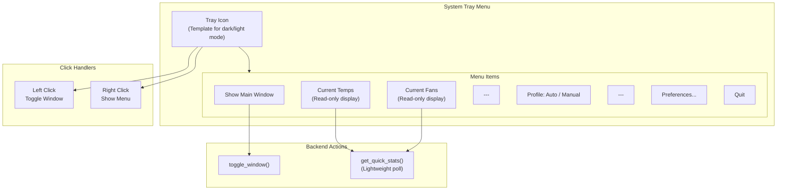
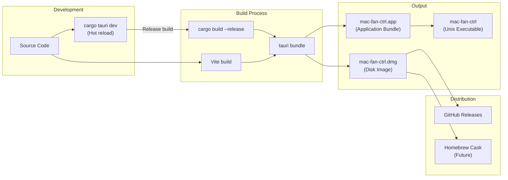
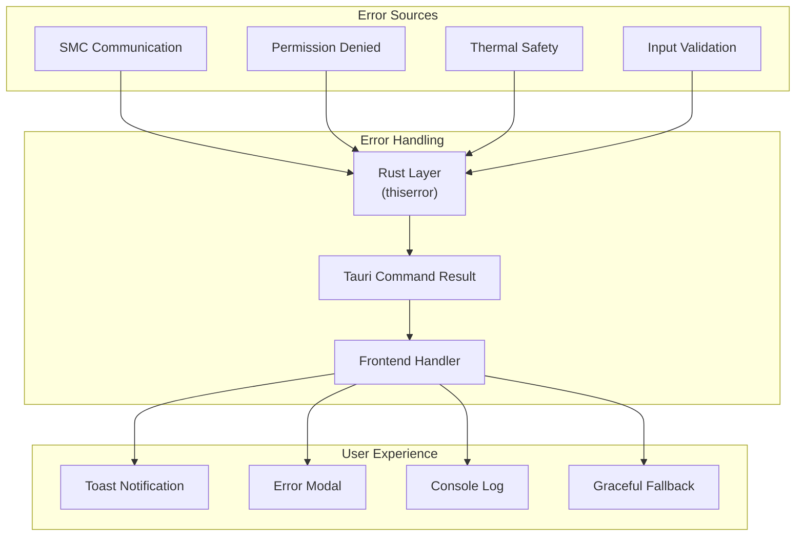

# mac-fan-ctrl System Architecture Diagrams

## 1. Component Architecture

---

## 2. Data Flow - Real-Time Monitoring

---

## 3. Data Flow - Manual Fan Control (Phase B)

---

## 4. Module Dependencies

---

## 5. State Management

---

## 6. Menu Bar / System Tray Architecture

---

## 7. Deployment Architecture

---

## 8. Error Handling Flow

---

*Diagrams created with Mermaid syntax*
*Version: 1.0*
