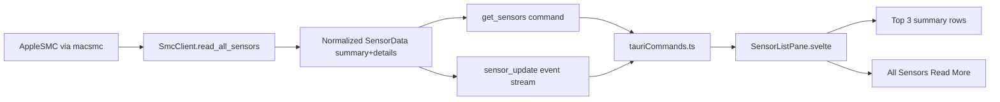

# Sensor Reading Architecture

This document explains how `mac-fan-ctrl` reads sensor data, how it travels from Rust to Svelte, and why some values appear as `N/A`.

## 1) Sensor Reading Architecture (macOS -> Rust)

At runtime, the backend uses the `macsmc` crate to connect to Apple SMC and read several sensor families:

- CPU temperatures
- CPU core temperatures
- GPU temperatures
- Other temperatures (memory bank, trackpad-adjacent, airport, etc.)
- Battery temperatures
- Power values (Watt)

The core reader is `SmcClient` in `src-tauri/src/smc.rs`.

### Backend shape

Backend returns:

- `SensorData`
  - `summary`: compact set for top panel (`cpu_package`, `gpu`, `ram`, `ssd`)
  - `details`: full list for `Read More`

Each `Sensor` has:

- `key` (source key or synthetic key)
- `name` (UI label)
- `value` (`Option<f64>`, so it can be missing)
- `unit` (`C` or `W`)
- `sensor_type` (`Cpu`, `Gpu`, `Memory`, `Storage`, `Battery`, `Power`, `Trackpad`, `Other`)

### Collection pipeline in Rust

`SmcClient::read_all_sensors()`:

1. Reads all available sensor groups with dedicated helper functions.
2. Normalizes each reading into a `Sensor`.
3. Adds reference placeholders for key categories when missing (`SSD`, `Trackpad`, `Memory Bank 1`, `Battery`, `Power Supply`) with `value: None`.
4. Sorts sensors by type and name for stable UI ordering.
5. Builds `summary` with preferred-key fallback logic.

## 2) Architecture from Rust => Svelte

### Commands and event stream

- `get_sensors` command (`src-tauri/src/commands.rs`) fetches current snapshot on demand.
- Background stream (`start_sensor_stream` in `src-tauri/src/main.rs`) emits `sensor_update` every ~1500ms.

### Frontend bridge

`src/lib/tauriCommands.ts`:

- `getSensors()` -> invokes `get_sensors`
- `listenToSensorUpdates()` -> subscribes to `sensor_update`

### UI binding

`src/components/SensorListPane.svelte`:

1. Initial load calls `getSensors()`.
2. Subscribes to live updates via `listenToSensorUpdates()`.
3. Derives:
   - summary rows from `getSummarySensorsForDisplay()`
   - expanded rows from `getDetailSensorsInDisplayOrder()`

`src/lib/sensorListPaneState.ts` controls display logic:

- Summary list is fixed to:
  - `CPU Core Average`
  - `Battery`
  - `GPU Average`
- Read More list shows sorted full details.

## 3) Why some values show N/A

`N/A` is expected in several cases and is intentionally supported.

### Primary reasons

- Sensor key not available on this Mac model.
- Sensor exists but currently returns `0.0` or missing from SMC read path.
- Category placeholder inserted for UI completeness (for example `SSD`) when no real reading is available.

### Technical behavior

- Backend stores missing values as `value: None`.
- Frontend `formatValue()` renders `None` as `N/A`.
- This prevents fake numbers and keeps UI structure stable across hardware differences.

## 4) Practical debugging checklist

If list looks sparse or empty:

1. Confirm `get_sensors` returns `details` with entries.
2. Confirm frontend subscribes successfully to `sensor_update`.
3. Check sensor type mapping and summary derivation logic.
4. Verify values are `None` vs numeric to distinguish unavailable vs detected.

## 5) Data flow overview

