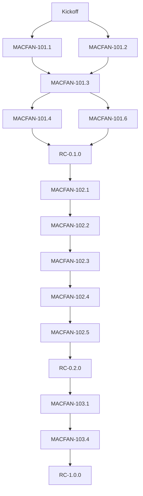

# mac-fan-ctrl Ticketing, Delivery Plan, DoD, Dates

## 1) Purpose and Scope

This document consolidates the RFC/PRD execution planning artifacts into one place:

- Ticket taxonomy and ownership
- Full backlog mapping to RFC/PRD
- Definition of Done (DoD)
- Milestones and release gates
- Safety/compatibility gate checklists

Source docs:
- [docs/rfc.md](rfc.md)
- [docs/prd.md](prd.md)
- [Plan attachment](~/.cursor/plans/mac-fan-ctrl-ticketing-and-execution-plan_01d16d03.plan.md)

## 2) Execution Taxonomy

- **Initiative**: `MACFAN-1000`
- **Epic**: `MACFAN-11x`
- **Story**: one PRD user story (US-A1..US-B4)
- **Task**: child slices for each story
- **Bug / Enabler / TechDebt**: support work
- **Release Candidate**: `RC-0.1.0`, `RC-0.2.0`, `RC-1.0.0`

### 2.1 Mandatory fields for every ticket

- `Title`
- `Owner`
- `Status`
- `Priority`
- `Estimate`
- `Depends on`
- `Due date`
- `Definition of Done`
- `Acceptance`
- `Risks`
- `Rollback note`

### 2.2 Board model

Columns: Backlog, Ready, In Progress, In Review, Validation, Done  
WIP policy: max 2 in-progress tickets per engineer, max 1 `Story` in Validation before release gate approval.

### 2.3 Label/ID conventions

- Phases: `phase-a`, `phase-b`, `phase-c`
- Safety: `thermal-safety`, `rollback`, `permission`
- Area: `frontend`, `backend`, `smc`, `ui`, `qa`, `ops`
- RFC mapping tags: `SMC`, `MonitorService`, `TauriCommand`, `Tray`
- Naming:
  - Initiatives: `MACFAN-1000`
  - Epics: `MACFAN-101`, `MACFAN-102`, `MACFAN-103`
  - Stories: `MACFAN-101-US-A1`
  - Tasks: `MACFAN-101-US-A1-T-1`

## 3) Phase and Milestone Plan (calendar)

### 3.0 Sprint 0 (Readiness and Foundation)

- **Window:** 2026-03-04 to 2026-03-07
- **Scope owner:** Epic `MACFAN-101` (`MACFAN-101.0`, `MACFAN-101.0-T1`, `MACFAN-101.0-T2`, `MACFAN-101.0-T3`, `MACFAN-101.0-T4`)

**Objectives**
- Establish a reproducible local/dev workflow for all contributors.
- Lock baseline architecture assumptions from RFC before feature work.
- Finalize core design tokens and status semantics used by Phase A UI.
- Define minimum quality gates (lint/build/test) required to move tickets to `Ready`.

**Required Outputs**
- Scripts and documented run paths for install, dev, test, and release checks.
- Architecture baseline notes covering service boundaries and command/event contracts.
- Design system baseline (spacing, typography, colors, state tokens, theme variables).
- Working "Hello World" vertical slice: Svelte view -> Tauri command -> Rust response rendered in UI.
- Initial risk list for hardware compatibility, permissions, and thermal-safety behavior.

**Exit Criteria (must pass before Week 1 feature tickets)**
- `MACFAN-101.0-T1/T2/T3/T4` moved to `Done` with evidence links.
- Build and lint complete on at least one Apple Silicon machine.
- `Ready` ticket template fields validated for owner, acceptance, DoD, and rollback note.
- RC dependency chain remains intact (`MACFAN-101.1+` blocked until Sprint 0 complete).

### 3.1 Overall windows

- **Phase A (Read-only monitoring):** 2026-03-04 to 2026-03-31
  - Target: `RC-0.1.0` on 2026-03-31
- **Phase B (Fan control + safety):** 2026-04-01 to 2026-04-28
  - Target: `RC-0.2.0` on 2026-04-28
- **Phase C (Polish + hardening):** 2026-04-29 to 2026-05-26
  - Target: `RC-1.0.0` on 2026-05-26

### 3.2 Week-by-week checkpoints

- W1 2026-03-04 to 2026-03-10: app shell + foundation
- W2 2026-03-11 to 2026-03-17: read path and sensor model
- W3 2026-03-18 to 2026-03-24: real-time UI and menu bar
- W4 2026-03-25 to 2026-03-31: Phase A hardening and `RC-0.1.0` readiness
- W5 2026-04-01 to 2026-04-07: safety command scaffolding
- W6 2026-04-08 to 2026-04-14: manual + sensor-based control wiring
- W7 2026-04-15 to 2026-04-21: curves and profiles
- W8 2026-04-22 to 2026-04-28: control safety validation + `RC-0.2.0`
- W9 2026-04-29 to 2026-05-05: historical data and polish
- W10 2026-05-06 to 2026-05-12: alerts + settings improvements
- W11 2026-05-13 to 2026-05-19: compatibility + compatibility regression
- W12 2026-05-20 to 2026-05-26: release documentation + `RC-1.0.0`

## 4) Backlog (RFC-to-PRD traceable tickets)

### 4.1 Epic MACFAN-101 (Phase A foundation)

- `MACFAN-101.0` – Project setup, system architecture notes, and design system base (Due: 2026-03-10)
- `MACFAN-101.0-T1` – Scaffold repository tooling (scripts, lint/format, build/run paths, environment setup)
- `MACFAN-101.0-T2` – Define cross-platform baseline assumptions from RFC architecture
- `MACFAN-101.0-T3` – Establish design system primitives (spacing/typography/color tokens, theme variables, status states)
- `MACFAN-101.0-T4` – Foundation Hello World flow (Tauri + Rust + Svelte round-trip with basic integration test)
- `MACFAN-101.1` – Tauri shell + menu bar bootstrapping (Due: 2026-03-17)
- `MACFAN-101.2` – Menu Bar + App Shell Delivery (US-A1), Due: 2026-03-24
- `MACFAN-101.3` – Real-Time Temperature Monitoring (US-A2), Due: 2026-03-31
- `MACFAN-101.4` – Performance Baseline (US-A3), Due: 2026-03-31
- `MACFAN-101.5` – Multi-Fan Coverage (US-A4), Due: 2026-03-31
- `MACFAN-101.6` – Alerts Baseline (US-A5), Due: 2026-03-31
- `MACFAN-101.7` – Historical Storage Baseline (US-A6), Due: 2026-03-31

### 4.2 Epic MACFAN-102 (Phase B control + safety)

- `MACFAN-102.1` – Safe Permission and Command Framework, Due: 2026-04-07
- `MACFAN-102.2` – Manual Fan Controls (US-B1), Due: 2026-04-14
- `MACFAN-102.3` – Sensor-based Curves (US-B2), Due: 2026-04-21
- `MACFAN-102.4` – Profiles and Auto restore (US-B3), Due: 2026-04-28
- `MACFAN-102.5` – Safety enforcement (US-B4), Due: 2026-04-28

### 4.3 Epic MACFAN-103 (Phase C polish)

- `MACFAN-103.1` – Data Export and Long-range History, Due: 2026-05-05
- `MACFAN-103.2` – Notification Quality and Alerts hardening, Due: 2026-05-12
- `MACFAN-103.3` – Preferences and system settings completion, Due: 2026-05-19
- `MACFAN-103.4` – Compatibility and reliability hardening, Due: 2026-05-19
- `MACFAN-103.5` – Release prep and docs, Due: 2026-05-26

### 4.4 Story task pattern

Use at least two tasks per story, e.g.:

- `MACFAN-101.2-T1` – backend telemetry command support
- `MACFAN-101.2-T2` – tray UI render states + interactions
- `MACFAN-102.1-T1` – permission contract + elevated write path
- `MACFAN-102.1-T2` – permission-denied integration test

### 4.5 Non-functional but required foundation work

- `MACFAN-101.0` and its tasks are required before delivery tickets start and are explicitly tracked in the backlog.
- Foundation work enables consistent implementation:
  - Shared architecture decisions and service boundaries from RFC.
  - Shared design tokens, theme variables, and component standards.
  - Reproducible build/test/lint workflows with quality gates.
  - End-to-end foundation proof via a "Hello World" vertical slice before feature tickets.
- PRD and RFC define *what* and *how at high level*; tickets make ownership, acceptance, DoD, and validation explicit.

## 5) Definition of Done (for all tickets)

### Universal DoD (required before moving to Done)

- Acceptance criteria implemented and verified
- Unit + integration tests (including failure path)
- Performance/resource impact recorded where applicable
- Permission and safety behavior documented
- Error and fallback strategy recorded
- Rollback note included (revert + mitigation + data impact)
- Regression checks executed
- User-facing behavior and release notes updated

### Story-level DoD

- All child tasks complete
- End-to-end flow matches PRD acceptance
- No known crashes introduced
- State/performance checks included for UI/monitor stories

### Epic-level DoD

- All stories in Validation or above
- Backend↔Frontend contracts validated
- Minimum supported hardware behavior confirmed
- Security/performance reviewed for fan-write modules

## 6) Phase Gates

### 6.1 Phase B Gate (`PhaseB_Gate`)

- Emergency override path implemented and tested
- Critical threshold and min/max RPM guard configured
- Auto restore on threshold breach and on close/exit
- `set_fan_speed` + `set_fan_auto` paths tested
- Permission errors handled safely
- SMC retry/backoff and unsupported-model no-crash behavior

### 6.2 Final Gate (`Compatibility_Gate`)

- Intel + Apple Silicon validations executed
- Sensor fallback for unavailable/restricted data
- 24h stability and memory growth checks
- Crash recovery returns all controllable fans to Auto
- Release notes include hardware limitations

## 7) Dependency graph

## 8) Blocker rules

- `RC-0.1.0` requires full Phase A DoD completion.
- Phase B cannot start before `RC-0.1.0` readiness.
- `RC-0.2.0` requires all safety gates closed.
- `RC-1.0.0` requires compatibility and hardening gates.

## 9) Governance cadence

- Daily: blockers + date shifts
- Weekly: phase DoD + risks review
- Safety dependency blockers move to `on-hold` with owner escalation
- DoD sign-off required before RC transitions
